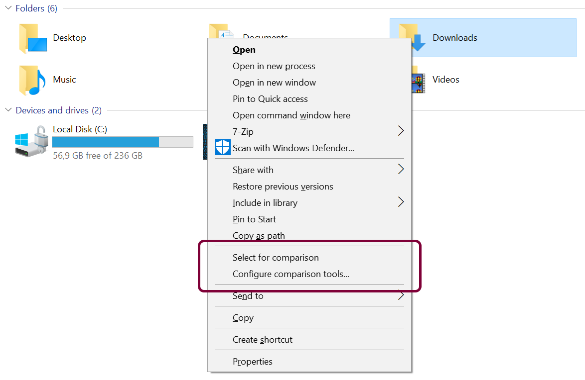
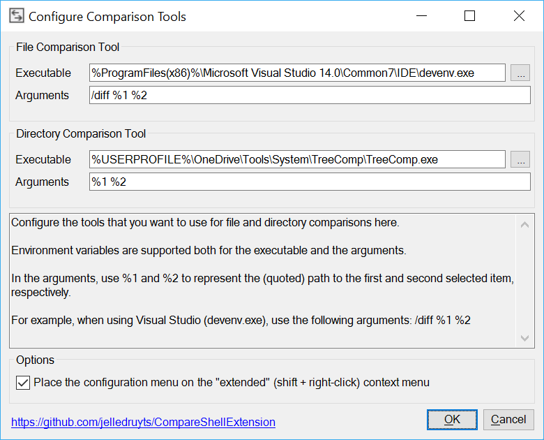
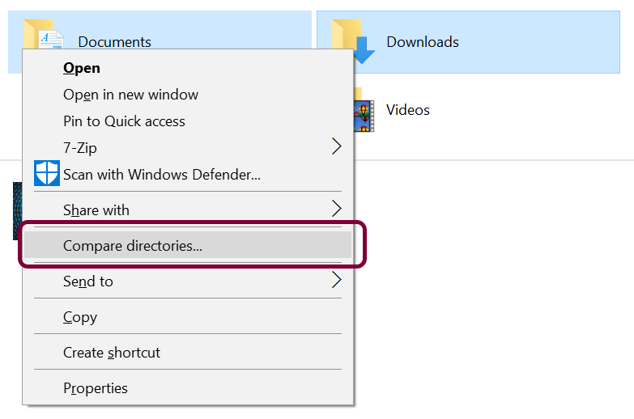
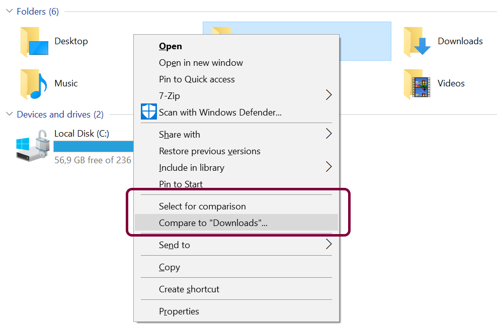

## Installation

Simply run the provided `Install.bat` file as an administrator and choose the install option. This will copy the shell extension into the `Program Files\CompareShellExtension` directory and register it with Windows.

To uninstall, run the same batch file (a copy is always placed in `Program Files\CompareShellExtension`) and choose the uninstall option which will remove all traces of it.

## Configuration

Right-click any file or directory in Windows Explorer and select `Configure comparison tools`.

This will open the configuration screen which allows you to specify the tools to use for comparing files and directories.

You can use environment variables in the executable path and arguments, and you can use `%1` and `%2` in the arguments to represent the (quoted) path to the first and second selected item, respectively.

For example, to use Visual Studio 2015 as the file compare tool, use the following configuration:
* Executable: `%ProgramFiles(x86)%\Microsoft Visual Studio 14.0\Common7\IDE\devenv.exe`
* Arguments: `/diff %1 %2`

You can also choose to make the menu item to access this configuration screen available only on the "extended" context menu, i.e. when shift + right-clicking on a file or directory in Windows Explorer.

## Usage

The process is exactly the same for files and directories, but we'll use directories as the example here.

You can either simply select two directories, right-click and select `Compare directories` to launch the configured compare tool:

Or you can start by right-clicking the first directory to compare and selecting `Select for comparison`. Then right-click the second directory and select `Compare to (first)` to start the comparison.

To clear the file and directory that was previously selected for comparison, open the "extended" context menu (shift + right-click) and select `Clear selection for comparison`.